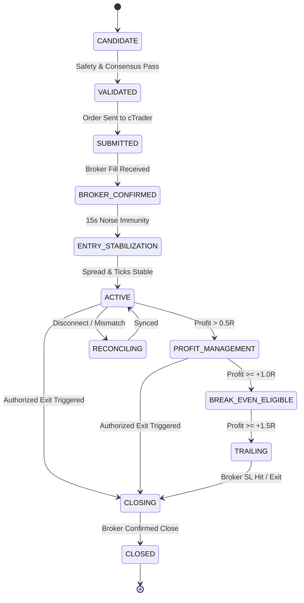

# TRADETALK — POSITION MANAGEMENT V3 & STRUCTURAL EXIT AUDIT REPORT

**Date:** 2026-09-09  
**Module:** `PositionManagerV3` & `PositionSentinel`  
**Execution Gateway:** Spotware cTrader Open API & Local Bridge  
**Status:** **ACTIVE & PRODUCTION HARDENED**

---

## 1. Executive Summary

Position Management V3 replaces all simplistic exit assumptions with an institutional, 14-state lifecycle machine, true position-specific 1R accounting, a strict Authorized Exit Model, and structural invalidation rules.

---

## 2. 14-State Lifecycle State Machine

### Explicit States:
1. `CANDIDATE`: Signal formed by Pre-Trade Engine.
2. `VALIDATED`: Approved by 7-Agent Consensus & Live Safety Gate.
3. `SUBMITTED`: Dispatched via authenticated cTrader gateway.
4. `BROKER_CONFIRMED`: Ticket acknowledged by broker ledger.
5. `ENTRY_STABILIZATION`: Post-fill stabilization window (15s) ignoring noise.
6. `ACTIVE`: Trade breathing within normal volatility bounds.
7. `PROFIT_MANAGEMENT`: Managing risk-free transition.
8. `BREAK_EVEN_ELIGIBLE`: Profit $\ge +1.0R$; Stop Loss moved to Entry + spread buffer.
9. `TRAILING`: Profit $\ge +1.5R$; dynamic monotonic trailing active.
10. `PARTIAL_EXIT`: Scaling out lots at multi-target objectives.
11. `CLOSING`: Authorized close order in-flight.
12. `CLOSED`: Confirmed closed by broker deal ticket.
13. `RECONCILING`: State being audited against cTrader ledger.
14. `ERROR`: Operational anomaly requiring operator intervention.

---

## 3. Position-Specific True 1R Accounting

Universal fixed dollar rules (e.g. $1R = \$5.00$) are **completely eliminated**.

### True 1R Definition:
$$\text{Initial Risk (1R)} = |\text{Entry Price} - \text{Initial Stop Loss}|$$

### Rules:
1. **Permanent 1R Value:** Stored permanently at position registration. It is **never recalculated** when the Stop Loss moves to Break-Even or Trails.
2. **Break-Even Trigger:** Activated strictly when $\text{Unrealized Profit} \ge +1.0R$.
3. **Trailing Stop Trigger:** Activated strictly when $\text{Unrealized Profit} \ge +1.5R$ to lock in $\ge +0.5R$ profit.
4. **Monotonicity:**
   - **BUY:** $\text{New SL} > \text{Current SL}$ (strictly upward).
   - **SELL:** $\text{New SL} < \text{Current SL}$ (strictly downward).
5. **Take Profit Retention:** Every SL modification preserves the original target Take Profit.

---

## 4. Authorized Exit Model

Positions may ONLY exit through one of the 9 authorized exit paths:

| Exit Model | Condition | Validated Authority |
| :--- | :--- | :--- |
| `BROKER_STOP_LOSS` | Broker order filled at Stop Loss | Authoritative Broker |
| `BROKER_TAKE_PROFIT` | Broker order filled at Take Profit | Authoritative Broker |
| `STRUCTURAL_INVALIDATION` | Confirmed CHoCH/MSS on **completed 5M/15M candle** | `StructuralExitEngine` |
| `VALIDATED_TRAILING_STOP` | Trailing stop hit at broker | Authoritative Broker |
| `VALIDATED_BREAK_EVEN` | Break-even stop hit at broker | Authoritative Broker |
| `ACCOUNT_RISK_EMERGENCY` | Global drawdown / daily loss threshold reached | `RiskEngine` |
| `BROKER_SAFETY_EVENT` | Margin call / broker forced liquidation | Broker Event |
| `MANUAL_AUTHORIZED_CLOSE` | Operator explicit close command from UI | Operator UI |
| `STRATEGY_EXIT` | Multi-target objective achieved | Strategy Lab Engine |

**Strictly Prohibited:**
- AI bias change alone.
- 5-second indicator flip alone.
- Sub-second bid/ask spread fluctuation.

---

## 5. Anti-Flip Engine & Spread Whiplash Protection

- **Cooldown Window:** After a position closes, opposite direction trades on that symbol are blocked for 60 seconds unless a confirmed Higher-Timeframe market structure break occurs.
- **Zero Spread Whiplash:** Eliminates the historical defect where a closed BUY immediately spawned a losing SELL 1 second later.
