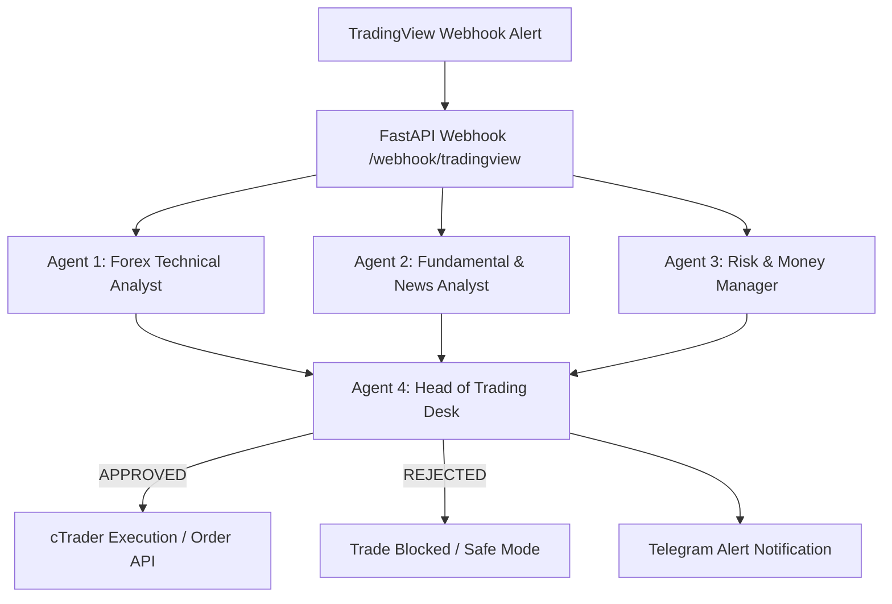

# 🤖 Multi-Agent AI Forex Trading System

An automated multi-agent Forex trading analysis system powered by **Google Gemini**, **LangChain**, and **FastAPI**. It receives real-time webhook alerts from TradingView, runs multi-agent consensus analysis (Technical, News/Fundamental, Risk Management, and Head Desk Manager), and automatically executes verified trades.

---

## 🚀 1-Click Cloud Deployment (Render)

Deploy this service to **Render** with a single click:

[](https://render.com/deploy)

### Cloud Deployment Steps:
1. Click the **Deploy to Render** button above.
2. Sign in to your [Render](https://render.com) account.
3. In the environment variables configuration section:
   - Set **`GOOGLE_API_KEY`**: Enter your Google Gemini API Key.
   - Set **`GROQ_API_KEY`** (optional): If using Groq models.
4. Click **Apply** / **Deploy**.
5. Render will automatically build the service and provide you with a public URL:
   ```text
   https://multi-agent-trading-bot-xxxx.onrender.com
   ```

Your Webhook endpoint will be:
```text
https://multi-agent-trading-bot-xxxx.onrender.com/webhook/tradingview
```

---

## 📈 TradingView Webhook Configuration

Follow these steps to connect TradingView alerts directly to your AI multi-agent backend:

### Step 1: Create an Alert in TradingView
1. Open your chart on **TradingView**.
2. Click the **Alert** button (or press `Alt + A`).
3. Under **Condition**, choose your Strategy or Indicator.

### Step 2: Set Webhook URL
1. Switch to the **Notifications** tab in the alert dialog.
2. Check the **Webhook URL** option.
3. Paste your public deployment URL:
   ```text
   https://multi-agent-trading-bot-xxxx.onrender.com/webhook/tradingview
   ```
   *(For local testing via Cloudflare Tunnel, use the generated `https://...trycloudflare.com/webhook/tradingview` URL)*

### Step 3: Set Message Payload
Paste the following JSON format in the **Message** box:

```json
{
  "symbol": "{{ticker}}",
  "action": "{{strategy.order.action}}",
  "entry_price": {{close}},
  "stop_loss": {{plot("StopLoss")}},
  "take_profit": {{plot("TakeProfit")}},
  "timeframe": "{{interval}}",
  "strategy_name": "Trend_Crossover_v1"
}
```

---

## 💻 Local One-Click Setup & Testing

For local development and testing with a free public tunnel:

1. Copy `.env.example` to `.env` and fill in your API key:
   ```ini
   GOOGLE_API_KEY=your_gemini_api_key_here
   ```
2. Double-click **`run_local.bat`** (or run it from PowerShell/CMD).
   - This starts the **FastAPI Uvicorn server** on port `8000`.
   - It also launches a **Cloudflare Tunnel** (`cloudflared`) to give you an instant public HTTPS URL for TradingView webhooks without port forwarding.
3. To test sending a simulated signal locally:
   ```powershell
   python test_webhook.py
   ```

---

## 🧠 Multi-Agent Architecture



1. **Technical Analyst Agent**: Verifies price action, trend validation, and setup score (1-100).
2. **Fundamental & News Analyst Agent**: Assesses high-impact economic news (CPI, NFP, rate hikes) and market sentiment.
3. **Risk & Money Manager Agent**: Calculates exact position/lot size based on account balance ($10,000) and strict 1% risk rules.
4. **Head of Trading Desk Agent**: Evaluates all reports to issue a final consensus verdict (`APPROVED` or `REJECTED`).
